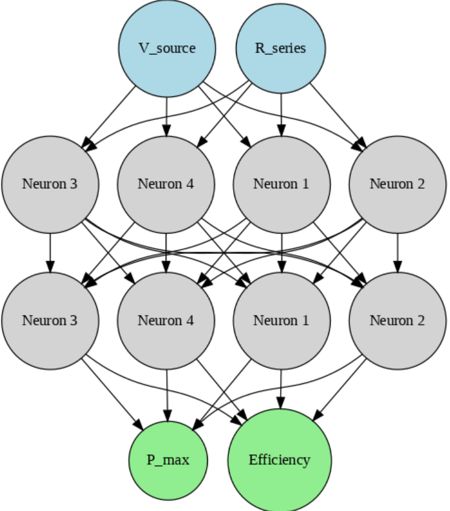

# Power Efficiency Estimation Using Neural Networks

## Overview
This project trains a neural network to estimate **maximum power** and **efficiency** based on input values of voltage source $V_{source}$ and series resistance $R_{series}$. The model learns from synthetic training data and predicts power-efficiency values for unseen inputs.

## Mathematical Formulation
### Power and Efficiency Calculation
The theoretical maximum power across the load is given by:
$$
P_{max} = \frac{V_{source}^2}{4 R_{series}}
$$
The efficiency is assumed to be:
$$
\eta = 50\%
$$

### Loss Function
The loss function used for training is **Mean Squared Error (MSE):**
$$
L(\theta) = \frac{1}{N} \sum_{i=1}^{N} \left( y_i - \hat{y}_i \right)^2
$$
where $y_i$ is the actual value and $\hat{y}_i$ is the predicted value.

### Optimization Algorithm
We use **Adam Optimizer**, which combines momentum and adaptive learning rates:
$$
\theta_{t+1} = \theta_t - \alpha \frac{m_t}{\sqrt{v_t} + \epsilon}
$$
where $m_t$ and $v_t$ are estimates of the first and second moments of gradients.

## Neural Network Architecture
The neural network consists of:
- **Input layer:** 2 neurons ($V_{source}, R_{series}$)
- **Hidden layers:** Two fully connected layers with ReLU activation
- **Output layer:** 2 neurons ($P_{max}, \eta$)

### Architecture Diagram (Generated in Python)
Below is a Python script to visualize the neural network architecture:



## Code Explanation
### Data Preparation
- **Synthetic training data** is generated with random values for $V_{source}$ and $R_{series}$.
- The theoretical power and efficiency are computed.
- Data is converted into PyTorch tensors.

### Model Definition
A **fully connected feedforward neural network** is implemented using `torch.nn.Linear` layers with ReLU activation:
```python
import torch
import torch.nn as nn

class PowerEfficiencyNN(nn.Module):
    def __init__(self):
        super(PowerEfficiencyNN, self).__init__()
        self.fc1 = nn.Linear(2, 32)
        self.fc2 = nn.Linear(32, 32)
        self.fc3 = nn.Linear(32, 2)
        self.relu = nn.ReLU()

    def forward(self, x):
        x = self.relu(self.fc1(x))
        x = self.relu(self.fc2(x))
        x = self.fc3(x)
        return x
```

### Training Process
- **Loss Function:** MSELoss
- **Optimizer:** Adam
- **Training Loop:** Runs for 1000 epochs with gradient backpropagation

```python
num_epochs = 1000
for epoch in range(num_epochs):
    optimizer.zero_grad()
    outputs = model(X_train)
    loss = criterion(outputs, y_train)
    loss.backward()
    optimizer.step()
    if epoch % 100 == 0:
        print(f"Epoch [{epoch}/{num_epochs}], Loss: {loss.item():.4f}")
```

### Prediction Function
Once trained, the model can predict power and efficiency for any new input:
```python
def predict_power_efficiency(V_source_input, R_series_input):
    model.eval()
    with torch.no_grad():
        input_tensor = torch.tensor([[V_source_input, R_series_input]], dtype=torch.float32)
        prediction = model(input_tensor).numpy()
        return prediction[0]
```

## Conclusion
This project demonstrates how a **neural network** can learn to approximate power and efficiency using regression. By training on simulated data, it can generalize and predict values for new inputs effectively.

