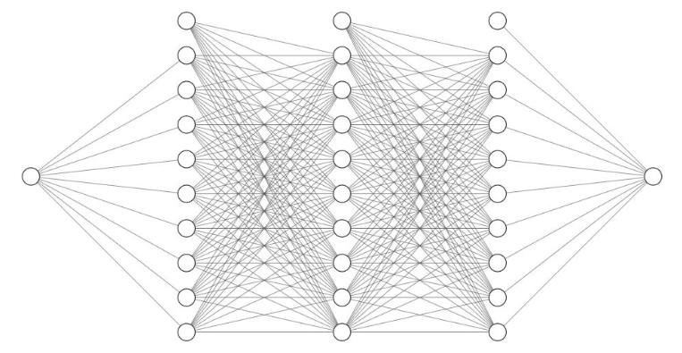

# Power Efficiency Estimation Using Neural Networks

## Overview
This project trains a neural network to estimate **maximum power** and **efficiency** based on input values of voltage source $V_{source}$ and series resistance $R_{series}$. The model learns from synthetic training data and predicts power-efficiency values for unseen inputs.

### Architecture Diagram



## Mathematical Formulation
### Power Calculation

The theoretical maximum power across the load is given by:

$$
P_{max} = \frac{V_{source}^2}{4 R_{series}}
$$

---

### Loss Function
The loss function used for training is **Mean Squared Error (MSE)**:

$$
L(\theta) = \frac{1}{N} \sum_{i=1}^{N} \left( y_i - \hat{y}_i \right)^2
$$

where:
- $y_{i}$ is the actual power/efficiency.
- $\hat{y}\_{i}$ is the predicted power/efficiency.
- $N$ is the total number of training examples.

MSE penalizes larger errors quadratically, making it sensitive to large deviations.

---

### Optimization Algorithm
We use the **Adam Optimizer**, which combines momentum and adaptive learning rates:

$$
\theta_{t+1} = \theta_t - \alpha \frac{m_t}{\sqrt{v_t} + \epsilon}
$$

where:
- $m_{t}$ and $v_{t}$ are estimates of the first and second moments of gradients.
- $\alpha\$ is the learning rate.

Adam helps achieve **faster convergence** and **better stability** compared to standard gradient descent.

## Neural Network Architecture
The neural network consists of:
- **Input layer:** 1 neurons $\( R_{load}\)$
- **Hidden layers:** Two fully connected layers with **ReLU activation**
- **Output layer:** 1 neurons $\((P_{max})\)$

### Why Use ReLU?
The **Rectified Linear Unit (ReLU)** activation function is used because:
- It helps **avoid vanishing gradients** (unlike Sigmoid or Tanh).
- It enables faster training by introducing **non-linearity**.
- Computation is efficient: $\( \max(0, x) \)$, meaning values below zero are discarded.

If no activation function were used, the network would behave like a linear regression model and fail to capture complex patterns in data.

### Backpropagation and Learning Process
Neural networks learn through **backpropagation**, which involves:
1. **Forward Pass:** Compute predictions $\( \hat{y} \)$.
2. **Compute Loss:** Use MSE to measure prediction error.
3. **Backward Pass:** Compute gradients using the chain rule.
4. **Weight Update:** Apply Adam optimizer to adjust weights.

## Code Explanation
### Data Preparation
- Generates random training data for $\( V_{source} \)$ and $\( R_{series} \)$.
- Computes $\( P_{max} \)$ and $\( \eta \)$ using theoretical formulas.
- Converts data into PyTorch tensors.

### Model Definition
A **fully connected feedforward neural network** is implemented using `torch.nn.Linear` layers with **ReLU activation**:

```python
import torch
import torch.nn as nn

class PowerEfficiencyNN(nn.Module):
    def __init__(self):
        super(PowerEfficiencyNN, self).__init__()
        self.fc1 = nn.Linear(2, 32)
        self.fc2 = nn.Linear(32, 32)
        self.fc3 = nn.Linear(32, 2)
        self.relu = nn.ReLU()

    def forward(self, x):
        x = self.relu(self.fc1(x))
        x = self.relu(self.fc2(x))
        x = self.fc3(x)
        return x
```

### Training Process
- **Loss Function:** `torch.nn.MSELoss()`
- **Optimizer:** Adam optimizer (`torch.optim.Adam()`)
- **Training Loop:** Runs for 1000 epochs with gradient backpropagation

```python
num_epochs = 1000
for epoch in range(num_epochs):
    optimizer.zero_grad()
    outputs = model(X_train)
    loss = criterion(outputs, y_train)
    loss.backward()
    optimizer.step()
    if epoch % 100 == 0:
        print(f"Epoch [{epoch}/{num_epochs}], Loss: {loss.item():.4f}")
```

### Prediction Function
Once trained, the model can predict power and efficiency for any new input:

```python
def predict_power_efficiency(V_source_input, R_series_input):
    model.eval()
    with torch.no_grad():
        input_tensor = torch.tensor([[V_source_input, R_series_input]], dtype=torch.float32)
        prediction = model(input_tensor).numpy()
        return prediction[0]
```

## Conclusion
This project demonstrates how a **neural network** can learn to approximate power and efficiency using regression. By training on simulated data, it can generalize and predict values for new inputs effectively.
