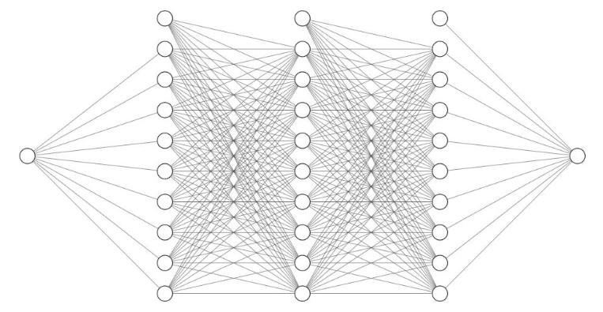

# Power Efficiency Estimation Using Neural Networks

## Overview
This project trains a neural network to estimate **maximum power** and **efficiency** based on input values of voltage source $V_{source}$ and series resistance $R_{series}$. The model learns from synthetic training data and predicts power-efficiency values for unseen inputs.

### Architecture Diagram



## Mathematical Formulation
### Power Calculation

The theoretical maximum power across the load is given by:

$$
P_{max} = \frac{V_{source}^2}{4 R_{series}}
$$

---

### Loss Function
The loss function used for training is **Mean Squared Error (MSE)**:

$$
L(\theta) = \frac{1}{N} \sum_{i=1}^{N} \left( y_i - \hat{y}_i \right)^2
$$

where:
- $y_{i}$ is the actual power/efficiency.
- ${y}_i$ is the predicted power/efficiency.
- $N$ is the total number of training examples.

MSE penalizes larger errors quadratically, making it sensitive to large deviations.

---

### Optimization Algorithm
We use the **Adam Optimizer**, which combines momentum and adaptive learning rates:

$$
\theta_{t+1} = \theta_t - \alpha \frac{m_t}{\sqrt{v_t} + \epsilon}
$$

where:
- $m_{t}$ and $v_{t}$ are estimates of the first and second moments of gradients.
- $\alpha$ is the learning rate.

Adam helps achieve **faster convergence** and **better stability** compared to standard gradient descent.

## Neural Network Architecture
The neural network consists of:
- **Input layer:** 1 neuron representing $R_{load}$
- **Hidden layers:** Four fully connected layers with **ReLU activation**
- **Output layer:** 1 neuron representing predicted power

### Why Use ReLU?
The **Rectified Linear Unit (ReLU)** activation function is used because:
- It helps **avoid vanishing gradients** (unlike Sigmoid or Tanh).
- It enables faster training by introducing **non-linearity**.
- Computation is efficient: $\max(0, x)$, meaning values below zero are discarded.

If no activation function were used, the network would behave like a linear regression model and fail to capture complex patterns in data.

### Backpropagation and Learning Process
Neural networks learn through **backpropagation**, which involves:
1. **Forward Pass:** Compute predictions $\hat{y}$.
2. **Compute Loss:** Use MSE to measure prediction error.
3. **Backward Pass:** Compute gradients using the chain rule.
4. **Weight Update:** Apply Adam optimizer to adjust weights.

## Code Explanation
### Data Preparation
- **Circuit Parameters:**
  - Voltage source: $V_{source}$ = 100V
  - Series resistance: $R_{series}$ = 1000Ω
- **Training Data:**
  - Random values of $`R_{load}`$ sampled between $`0.1 * R_{series}`$ and $`10 * R_{series}`$.
  - Computed power values using circuit equations.
  - Normalized $`R_{load}`$ relative to $`R_{series}`$ for better generalization.

```python
import torch
import torch.nn as nn
import torch.optim as optim
import numpy as np

# Define circuit parameters
V_source = 100
R_series = 1000

# Generate dataset: Power vs Efficiency for different R_load values
R_load_values = np.random.uniform(0.1 * R_series, 10 * R_series, 1000)
R_load_values.sort()
R_load_values = np.array([x for x in R_load_values if x != R_series])

# Calculate power values
power_values = (V_source*2 * R_load_values) / ((R_series + R_load_values) * 2)

# Normalize R_load relative to R_series
X_train = torch.tensor((R_load_values / R_series).reshape(-1, 1), dtype=torch.float32)
y_train = torch.tensor(power_values.reshape(-1, 1), dtype=torch.float32)
```

### Model Definition
A **fully connected feedforward neural network** is implemented using `torch.nn.Linear` layers with **ReLU activation**:

```python
class PowerPredictor(nn.Module):
    def __init__(self):
        super(PowerPredictor, self).__init__()
        self.fc1 = nn.Linear(1, 256)
        self.fc2 = nn.Linear(256, 128)
        self.fc3 = nn.Linear(128, 64)
        self.fc4 = nn.Linear(64, 1)
    
    def forward(self, x):
        x = torch.relu(self.fc1(x))
        x = torch.relu(self.fc2(x))
        x = torch.relu(self.fc3(x))
        return self.fc4(x)
```

### Training Process
- **Loss Function:** `torch.nn.MSELoss()`
- **Optimizer:** Adam optimizer (`torch.optim.Adam()`)
- **Training Loop:** Runs for 2000 epochs with gradient backpropagation

```python
# Initialize model, loss function, and optimizer
model = PowerPredictor()
criterion = nn.MSELoss()
optimizer = optim.Adam(model.parameters(), lr=0.001)

# Training loop
epochs = 2000
for epoch in range(epochs):
    optimizer.zero_grad()
    outputs = model(X_train)
    loss = criterion(outputs, y_train)
    loss.backward()
    optimizer.step()
    if epoch % 200 == 0:
        print(f'Epoch [{epoch}/{epochs}], Loss: {loss.item():.4f}')
```

### Prediction Function
Once trained, the model predicts power for a wide range of $`R_{load}`$ values:

```python
R_load_test = torch.linspace(0.1 * R_series, 10 * R_series, 1000).reshape(-1, 1)
R_load_test_normalized = R_load_test / R_series
predicted_power = model(R_load_test_normalized).detach().numpy().flatten()
```

### Finding Maximum Power Transfer
- Theoretical maximum power transfer occurs at $`R_{load} = R_{series}`$.
- The model's prediction is checked against theoretical values.

```python
# Theoretical maximum power transfer point
R_load_max_power = R_series
power_max_power = V_source**2 / (4 * R_series)

# Find model-predicted maximum power transfer point
predicted_max_power_index = np.argmax(predicted_power)
R_load_pred_max = R_load_test[predicted_max_power_index].item()
power_pred_max = predicted_power[predicted_max_power_index]
```

### Plot Results
```python
import matplotlib.pyplot as plt
plt.figure(figsize=(10, 5))
plt.plot(R_load_values, power_values, label="Power Curve (Training Data)", linestyle="dashed")
plt.plot(R_load_test, predicted_power, label="ML Predicted Power Curve", color="green")
plt.scatter(R_load_max_power, power_max_power, color="red", label="Theoretical Max Power")
plt.scatter(R_load_pred_max, power_pred_max, color="blue", label="ML Predicted Max Power")
plt.xlabel("Load Resistance (Ω)")
plt.ylabel("Power (W)")
plt.legend()
plt.title(f"Power vs Load Resistance (R_series = {R_series} Ω)")
plt.show()
```

## Conclusion
This project demonstrates how a **neural network** can approximate power values using regression. By training on simulated data, it generalizes well to unseen inputs.

